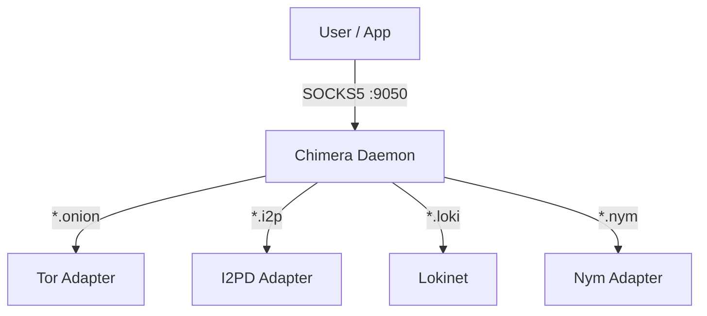

# Chimera: The Super Node 🦁🐍🐐

[](https://opensource.org/licenses/MIT)
[](https://www.rust-lang.org)
[](SECURITY.md)

**Chimera** is a unified, multi-protocol anonymity tool that orchestrates access to **Tor**, **I2P**, **Lokinet**, and **Nym** through a single, intelligent proxy interface.

> "One Proxy to Rule Them All."

---

## 🚀 Features

- **Unified SOCKS5 Interface**: Route `.onion`, `.i2p`, `.loki`, and `.nym` traffic transparently.
- **Protocol Chaining**: Route Tor over Nym for metadata obscuration.
- **Memory Safe**: Built in **Rust**, aligning with [CISA Memory Safety Guidance](https://www.cisa.gov/news-events/news/urgent-need-memory-safety-software-products).
- **Embedded Process Manager**: Automatically manages the lifecycle of Tor, I2P, and Lokinet daemons.
- **Decentralized Web**: Native support for IPFS, ZeroNet, and Freenet routing.

## 🏗️ Architecture

Chimera acts as a "Super Node" orchestrator. See [ARCHITECTURE.md](docs/ARCHITECTURE.md) for a deep dive.



## 🛠️ Installation

### Prerequisites

- **Linux / WSL2** (Recommended) or Windows
- **Rust Toolchain**: `curl --proto '=https' --tlsv1.2 -sSf https://sh.rustup.rs | sh`
- **Git**: `sudo apt install git`
- **Build Tools**: `sudo apt install build-essential cmake`

### Build from Source

1.  **Clone the Repository**:
    ```bash
    git clone --recursive https://github.com/thookham/Chimera-Super-Node.git
    cd Chimera-Super-Node
    ```

2.  **Build**:
    ```bash
    cargo build --release
    ```

3.  **Prepare Binaries**:
    Chimera requires external binaries for the protocols you wish to use.
    - Create a `bin/` directory: `mkdir bin`
    - **Tor**: Install `tor` (`sudo apt install tor`) or place `tor` executable in `bin/`.
    - **I2PD**: Install `i2pd` or place binary in `bin/`.
    - **Lokinet**: Install `lokinet` or place binary in `bin/`.

## 📖 Usage

1.  **Run the Daemon**:
    ```bash
    ./target/release/chimera_node
    ```
    *Chimera will automatically start configured sidecars (Tor, I2P, etc.) and listen on port 9050.*

2.  **Configure Your Browser**:
    Set your SOCKS5 proxy to `127.0.0.1:9050`.

3.  **Browse**:
    - Tor: `http://duckduckgo...onion`
    - I2P: `http://i2p-projekt.i2p`
    - Lokinet: `http://directory.loki`
    - IPFS: `http://ipfs.io.ipfs`

## 🔒 Security & CISA Compliance

Chimera is designed with security as a priority, following **CISA's Secure Software Development Framework**.

- **Memory Safety**: 100% Rust codebase prevents buffer overflows.
- **Input Validation**: Strict parsing of SOCKS5 headers and config files.
- **Least Privilege**: Sidecars run as separate processes; ideally, run Chimera as a non-root user.

See [SECURITY.md](SECURITY.md) for our full policy and reporting instructions.

## 🤝 Contributing

We welcome contributions! Please see [CONTRIBUTING.md](CONTRIBUTING.md).

## 📜 License

MIT License. See [LICENSE](LICENSE).
