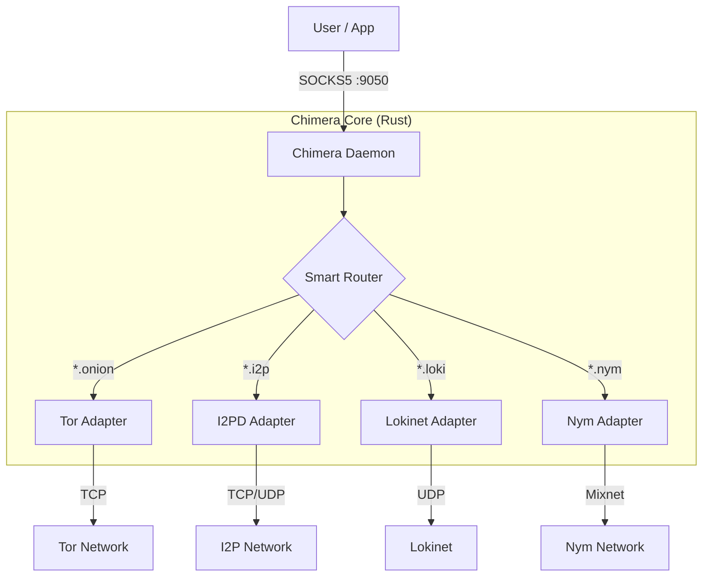

# Chimera: The Super Node 🦁🐍🐐

[](https://opensource.org/licenses/MIT)
[](https://www.rust-lang.org)
[](https://github.com/thookham/TorI2P_SuperNode)
[](CONTRIBUTING.md)

**Chimera** is a unified, multi-protocol anonymity tool that orchestrates access to **Tor**, **I2P**, **Lokinet**, and **Nym** through a single, intelligent proxy interface.

> "One Proxy to Rule Them All."

## 🚀 Features

-   **Unified Interface**: A single SOCKS5/HTTP proxy that routes traffic based on TLD.
    -   `.onion` → **Tor** (The Onion Router)
    -   `.i2p` → **I2PD** (Invisible Internet Project)
    -   `.loki` → **Lokinet** (LLARP)
    -   `.nym` → **Nym** (Mixnet)
-   **Rust Core**: Built in Rust for memory safety, performance, and native integration with Nym.
-   **Embedded Daemons**: Manages the lifecycle of underlying anonymity protocols automatically.
-   **Protocol Chaining** (Planned): Route Tor traffic through Nym for metadata resistance.

## 🏗️ Architecture

Chimera acts as a "Super Node" orchestrator, linking to C/C++ and Rust libraries to provide a seamless experience.



## 🛠️ Installation

### Prerequisites
-   **Rust**: `stable` toolchain ([Install Rust](https://rustup.rs/))
-   **CMake**: For compiling C/C++ dependencies.
-   **Git**: For fetching submodules.

### Build from Source

```bash
# Clone the repository with submodules
git clone --recursive https://github.com/thookham/Chimera-Super-Node.git
cd Chimera-Super-Node

# Build the project
cargo build --release
```

### Runtime Requirements

Chimera requires the **Tor** and **I2PD** binaries to be present in the `bin/` directory or in your system PATH.

1.  **Create a `bin` directory** in the project root.
2.  **Download Tor**: [Tor Expert Bundle](https://www.torproject.org/download/tor/)
    -   Extract `tor.exe` to `bin/tor.exe`.
3.  **Download I2PD**: [I2PD Releases](https://github.com/PurpleI2P/i2pd/releases)
    -   Extract `i2pd.exe` to `bin/i2pd.exe`.

```bash
# Run the daemon
./target/release/chimera_node
```

## 📖 Usage

Configure your browser or application to use the Chimera proxy:

-   **Proxy Type**: SOCKS5
-   **Host**: `127.0.0.1`
-   **Port**: `9050` (Default)

Now you can access:
-   `http://duckduckgogg42xjoc72x3sjasowoarfbgcmvfimaftt6twagswzczad.onion` (Tor)
-   `http://i2p-projekt.i2p` (I2P)
-   `http://directory.loki` (Lokinet)

## 🗺️ Roadmap

See [ROADMAP.md](ROADMAP.md) for our detailed development plan, including upcoming features like Protocol Chaining and GUI development.

## 🤝 Contributing

We welcome contributions! Please see [CONTRIBUTING.md](CONTRIBUTING.md) for guidelines on how to get started.

## 📜 License

This project is licensed under the MIT License - see the [LICENSE](LICENSE) file for details.

---
*Disclaimer: Chimera is experimental software. Do not rely on it for strong anonymity until it reaches a stable release.*
