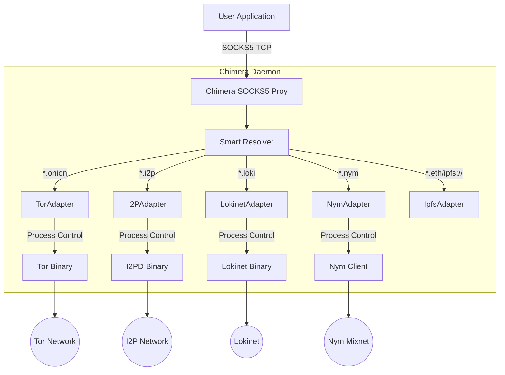
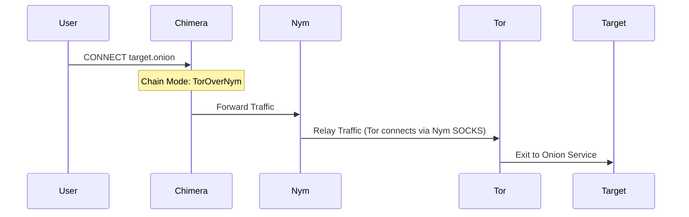

# 🏗️ Chimera System Architecture

Chimera is a unifying "Super Node" that orchestrates multiple anonymity networks (Tor, I2P, Lokinet, Nym) behind a single SOCKS5 interface. It allows applications to transparently access privacy-preserving services without needing to manage individual daemons.

## High-Level Overview

## Core Components

### 1. Process Manager (`src/process_manager.rs`)
The `ProcessManager` is responsible for the lifecycle of underlying anonymity daemons. 
- **Startup**: Checks for binary existence, creates data directories, and spawns child processes.
- **Monitoring**: (Planned) continuously checks health and restarts crashed services.
- **Shutdown**: Gracefully terminates child processes via SIGTERM/SIGKILL when Chimera exits.

### 2. Protocol Adapters (`src/adapters/`)
Each supported network has a dedicated adapter implementing the `ProtocolAdapter` trait.
- **Abstraction**: Provides a uniform interface (`start`, `stop`, `get_proxy_addr`).
- **Configuration**: Translates Chimera settings (`chimera.toml`) into command-line arguments specific to the daemon (e.g., `--SocksPort` for Tor, `--httpproxy.port` for I2P).

### 3. Smart SOCKS5 Server (`src/socks5.rs`)
A custom-built, async SOCKS5 server powered by `tokio`.
- **Handshake**: implements SOCKS5 authentication (currently NoAuth).
- **Request Parsing**: detailed parsing of CONNECT requests (IPv4, Domain).
- **TLD Routing**: Inspects the destination domain (e.g., `duckduckgo...onion`) and routes the traffic to the corresponding local proxy port (e.g., 127.0.0.1:9050).

## Protocol Chaining (Advanced)

Chimera supports routing one anonymity network *through* another (e.g., Tor over Nym).

## Directory Structure

- `bin/`: External binaries (tor, i2pd, etc.)
- `data/`: Persistent data directories for each protocol (keys, databases).
- `src/`: Rust source code.
- `docs/`: Documentation.

## Design Principles

1.  **Safety**: Use Rust's memory safety guarantees.
2.  **Modularity**: New protocols are added by ensuring they provide a SOCKS/HTTP proxy interface.
3.  **Simplicity**: The user only interacts with one port.
